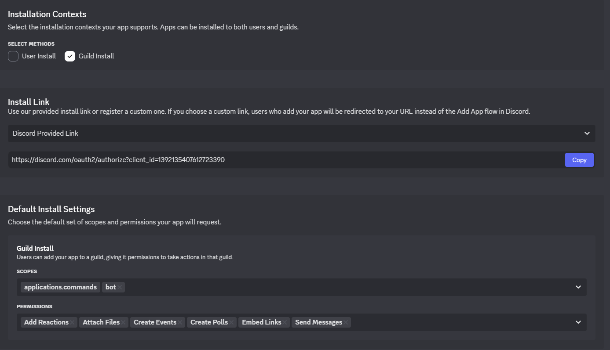

# Discord Bot for Creating Jams with theme votings and many more features

### User Commands:
- **`/help`**
  displayes all commands
- **`/timeleft`**
  displayes the time left for the jam to the user using the command
- **`/jam`**
  displayes the current theme and time left for jam
- **`/theme`**
  displayes the current theme
- **`/addtheme`**
  adds a new theme to the theme pool for the theme votings

### Jam-Admin Commands
  *These command can only be run by someone with the role specified with /setup*
  - **`/createjam`**
  creates a new Jam (there can only be one Jam at a time)
  - **`/deletejam`**
  deletes the current Jam
  - **`/announcewinner`**
  anounces the winner
  - **`/deletetheme`**
  deletes a them from the theme pool for the theme votings

#### The Command arguments get shown in Discord.

----
### Installation:
1. use the link: https://discord.com/oauth2/authorize?client_id=1392135407612723390 to add the bot to your server
2. use `/setup` to setup the bot and choose a Jam channel (the channel the bot will post updates about the current jam) and the Jam admin role (the people that can create jams and stuff)

----
### Host the bot yourselve:
1. clone the github repo (https://github.com/Joko-26/jam-bot.git)
2. create a new bot in the [discord developer portal](https://discord.com/developers/)
    1. In the installation tab match this settings:
       and use the provided link to install the bot (**NOTE: the bot only works if you at the bot to servers while its running**)
3. create a Create a .env file at the root of the project and fill in:   `DISCORD_TOKEN=token` you find the token in the Bot tab of your Bot in the [discord developer portal](https://discord.com/developers/)   `DISCORD_CLIENT_ID=bot id` you find the bot id in the general tab of your bot in the [discord developer portal](https://discord.com/developers/)
4. launch the application with `npm run dev` or build it with `npm run build` and start it with `npm run start` for production.
 